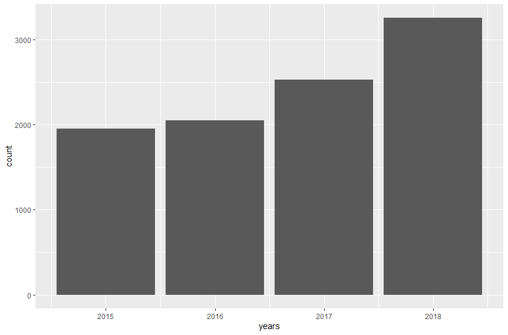
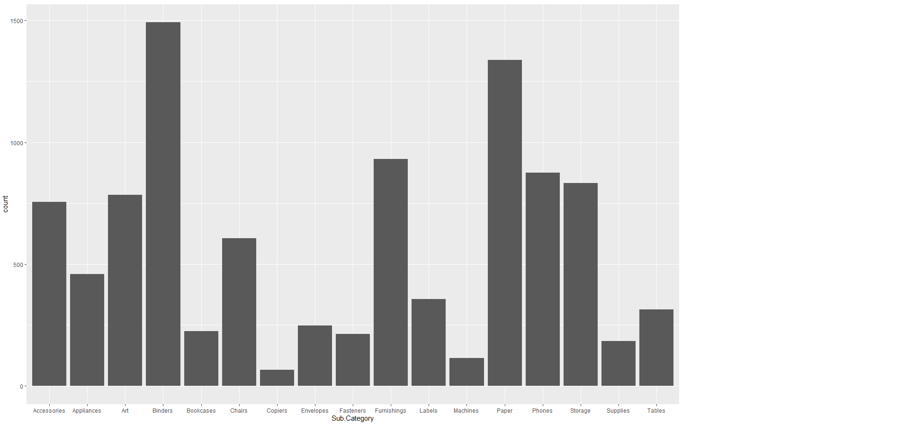

# R-Assignment 4

**Created by Thiti Ouengcharoen (ID: 63130500059)**

Dataset:
Superstore Sales Dataset (Data from Rohit Sahoo, [Kaggle](https://www.kaggle.com/rohitsahoo/sales-forecasting)) >> [Using CSV](https://raw.githubusercontent.com/safesit23/INT214-Statistics/main/datasets/superstore_sales.csv)


### Outlines
1. Explore the dataset
2. Learning about library => tm, wordcloud
3. Transform data with dplyr and finding insight the data
4. Visualization with GGplot2

## Part 1: Explore the dataset

```
# Library
# dplyr -> A Grammar of Data Manipulation
library(dplyr)
# readr -> Read Rectangular Text Data (like 'csv', 'tsv', and 'fwf')
library(readr)
# ggplot2 -> Create Elegant Data Visualisations Using the Grammar of Graphics
library(ggplot2)
# lubridate -> Dates and times made easy with lubridate
library(lubridate)

# Dataset
superstore_sales <- read.csv('https://raw.githubusercontent.com/safesit23/INT214-Statistics/main/datasets/superstore_sales.csv')
glimpse(superstore_sales)
View(superstore_sales)
```

In this dataset has .....
Rows: 9,800
Columns: 18
```
$ Row.ID        <int> 1, 2, 3, 4, 5, 6, 7, 8, 9, 10, 11, 12, 13, 14, 15, 16, 17, 18, 19, 20, 21, 22, 23, 24, 25, 26, 27,~
$ Order.ID      <chr> "CA-2017-152156", "CA-2017-152156", "CA-2017-138688", "US-2016-108966", "US-2016-108966", "CA-2015~
$ Order.Date    <chr> "08/11/2017", "08/11/2017", "12/06/2017", "11/10/2016", "11/10/2016", "09/06/2015", "09/06/2015", ~
$ Ship.Date     <chr> "11/11/2017", "11/11/2017", "16/06/2017", "18/10/2016", "18/10/2016", "14/06/2015", "14/06/2015", ~
$ Ship.Mode     <chr> "Second Class", "Second Class", "Second Class", "Standard Class", "Standard Class", "Standard Clas~
$ Customer.ID   <chr> "CG-12520", "CG-12520", "DV-13045", "SO-20335", "SO-20335", "BH-11710", "BH-11710", "BH-11710", "B~
$ Customer.Name <chr> "Claire Gute", "Claire Gute", "Darrin Van Huff", "Sean O'Donnell", "Sean O'Donnell", "Brosina Hoff~
$ Segment       <chr> "Consumer", "Consumer", "Corporate", "Consumer", "Consumer", "Consumer", "Consumer", "Consumer", "~
$ Country       <chr> "United States", "United States", "United States", "United States", "United States", "United State~
$ City          <chr> "Henderson", "Henderson", "Los Angeles", "Fort Lauderdale", "Fort Lauderdale", "Los Angeles", "Los~
$ State         <chr> "Kentucky", "Kentucky", "California", "Florida", "Florida", "California", "California", "Californi~
$ Postal.Code   <int> 42420, 42420, 90036, 33311, 33311, 90032, 90032, 90032, 90032, 90032, 90032, 90032, 28027, 98103, ~
$ Region        <chr> "South", "South", "West", "South", "South", "West", "West", "West", "West", "West", "West", "West"~
$ Product.ID    <chr> "FUR-BO-10001798", "FUR-CH-10000454", "OFF-LA-10000240", "FUR-TA-10000577", "OFF-ST-10000760", "FU~
$ Category      <chr> "Furniture", "Furniture", "Office Supplies", "Furniture", "Office Supplies", "Furniture", "Office ~
$ Sub.Category  <chr> "Bookcases", "Chairs", "Labels", "Tables", "Storage", "Furnishings", "Art", "Phones", "Binders", "~
$ Product.Name  <chr> "Bush Somerset Collection Bookcase", "Hon Deluxe Fabric Upholstered Stacking Chairs, Rounded Back"~
$ Sales         <dbl> 261.9600, 731.9400, 14.6200, 957.5775, 22.3680, 48.8600, 7.2800, 907.1520, 18.5040, 114.9000, 1706~
```

## Part 2: Learning function from lubridate

- Function `ymd(), mdy(), dmy()` from package [lubridate](https://cran.r-project.org/web/packages/lubridate/vignettes/lubridate.html)). It using for format management to make it easier to use day, month, year.
```
ymd("20110604")
mdy("06-04-2011")
dmy("04/06/2011")
```
Result:
[1] "2011-06-04"
[1] "2011-06-04"
[1] "2011-06-04"

## Part 3: Transform data with dplyr and finding insight the data
1. Which US city had the most orders in 2018, and how much more than the least?
```
countState <- superstore_sales %>% count(State)
countState <- data.frame(countState)
countState %>% filter(n == max(n) | n == min(n))
countState %>% summarise(max(n) - min(n))
```
Result:
```
       State    n
1 California 1946
2    Wyoming    1

  max(n) - min(n)
1            1945
```
// ใช้คำสั่ง `count(State)` เพื่อนับจำนวนในแต่ละ State
// ใช้คำสั่ง `data.frame(countState)` เพื่อสร้าง data frame ที่เก็บ State กับจำนวนการสั่งซื้อ
// ใช้คำสั่ง `filter(n == max(n) | n == min(n))` เพื่อหารัฐที่มีจำนวนสั่งซื้อมากที่สุดและน้อยที่สุด
// ใช้คำสั่ง `summarise(max(n) - min(n))` เพื่อหาหาผลต่างของรัฐที่มีจำนวนสั่งซื้อมากที่สุดและน้อยที่สุด

2. In each category, what are the best-selling subcategory?
```
countCategory <- superstore_sales %>% select(Category, Sub.Category) %>% group_by(Category) %>% count(Sub.Category)
countCategory %>% filter(n == max(n))
```
Result:
```
# A tibble: 3 x 3
# Groups:   Category [3]
  Category        Sub.Category     n
  <chr>           <chr>        <int>
1 Furniture       Furnishings    931
2 Office Supplies Binders       1492
3 Technology      Phones         876
```
// ใช้คำสั่ง `select(Category, Sub.Category)` เพื่อเลือก Category, Sub.Category มาแสดงผล
// ใช้คำสั่ง `group_by(Category)` เพื่อจัดกลุ่มตาม Category
// ใช้คำสั่ง `count(Sub.Category)` เพื่อนับจำนวน Sub.Category ในแต่ละ Category
// ใช้คำสั่ง `filter(n == max(n))` เพื่อหาเลือกจำนวน Sub.Category ที่ขายดีที่สุดในแต่ละ Category

3. What does each segment of customer buy the most?
```
segmentBuy <- superstore_sales %>% select(Segment, Sub.Category) %>% group_by(Segment) %>% count(Sub.Category)
segmentBuy %>% filter(n == max(n))
```
Result:
```
# A tibble: 3 x 3
# Groups:   Segment [3]
  Segment     Sub.Category     n
  <chr>       <chr>        <int>
1 Consumer    Binders        769
2 Corporate   Binders        460
3 Home Office Binders        263
```
// ใช้คำสั่ง `select(Segment, Sub.Category)` เพื่อเลือก Segment, Sub.Category มาแสดงผล
// ใช้คำสั่ง `group_by(Segment)` เพื่อจัดกลุ่มตาม Segment
// ใช้คำสั่ง `count(Sub.Category)` เพื่อนับจำนวน Sub.Category ในแต่ละกลุ่มลูกค้า
// ใช้คำสั่ง `filter(n == max(n))` เพื่อหาเลือกจำนวน Sub.Category ที่มีการซื้อสูงสุดในแต่ละ Segment

4. Which month in 2017 has the most orders and how much total sales?
```
month <- month(dmy(superstore_sales$Order.Date))
year <- year(dmy(superstore_sales$Order.Date))

order2017 <- superstore_sales %>% summarise(year, month, Sales) %>% filter(year == 2017)
monthOrder <- data.frame(order2017 %>% count(month))
monthOrder %>% filter(n == max(n))
order2017 %>% filter(month == 11) %>% summarise(sum(Sales))

```
Result:
```
  month   n
1    11 366

  sum(Sales)
1    79066.5
```
// ใช้คำสั่ง `month()` และ `year()` เพื่อดึงเดือนและปีจาก format `dmy()` วัน เดือน ปี
// ใช้คำสั่ง `summarise()` เพื่อสร้าง data frame ใหม่ที่เก็บ year month Sales
// ใช้คำสั่ง `filter(year == 2017)` เพื่อกรองเอาแต่ข้อมูลปี 2017
// ใช้คำสั่ง `count(month)` เพื่อหาจำนวน order ของแต่ละเดือนในปี 2017
// ใช้คำสั่ง `data.frame()` เพื่อสร้าง data frame ใหม่ที่เก็บ month และจำนวน order ฬนแต่ละเดือน
// ใช้คำสั่ง `filter(n == max(n))` เพื่อหาเดือนที่มี order สูงสุด
// ใช้คำสั่ง `summarise(sum(Sales))` เพื่อหายอดรวม Sales ของเดือนนั้น

5. Which Ship.Mode does the consumer choose the most?
```
consumerShip <- superstore_sales %>% filter(Segment == 'Consumer')
consumerShip %>% group_by(Ship.Mode) %>% count(Ship.Mode) %>% arrange(desc(n))
```
Result:
```
# A tibble: 4 x 2
# Groups:   Ship.Mode [4]
  Ship.Mode          n
  <chr>          <int>
1 Standard Class  3031
2 Second Class    1003
3 First Class      755
4 Same Day         312
```
// ใช้คำสั่ง `filter(Segment == 'Consumer')` เพื่อกรองเอาแต่ลูกค้าประเภท Consumer
// ใช้คำสั่ง `group_by(Ship.Mode)` จัดกลุ่มตาม Ship.Mode
// ใช้คำสั่ง `count(Ship.Mode)` นับจำนวนในแต่ละ Ship.Mode
// ใช้คำสั่ง `arrange(desc(n))` เพื่อเรียงจำนวนจากมากไปน้อย

6. What is the total sales each year? What is the average per year?
```
year <- year(dmy(superstore_sales$Order.Date))

sumSales <- superstore_sales %>% summarise(year, Sales)
sumSales <- sumSales %>% group_by(year) %>% summarise(sum(Sales))
sumSales
summary(sumSales$`sum(Sales)`)
```
Result:
```
# A tibble: 4 x 2
   year `sum(Sales)`
  <dbl>        <dbl>
1  2015      479856.
2  2016      459436.
3  2017      600193.
4  2018      722052.

   Min. 1st Qu.  Median    Mean 3rd Qu.    Max. 
 459436  474751  540024  565384  630657  722052 
```
// ใช้คำสั่ง `year()` เพื่อดึงปีจาก format `dmy()` วัน เดือน ปี
// ใช้คำสั่ง `summarise(sum(Sales))` เพื่อสร้าง data frame ใหม่ที่เก็บ year กับ Sales
// ใช้คำสั่ง `group_by(year)` จัดกลุ่มตามปี เพื่อหาผลรวมของ Sales แต่ละปี
// ใช้คำสั่ง `summary(sumSales$`sum(Sales)`)` เพื่อหา Mean อย่างง่ายและรวดเร็ว

7. Which product has the most repeat orders?
```
bestSeller <- superstore_sales %>% count(Product.ID)
bestSeller %>% filter(n == max(n))
```
Result:
```
       Product.ID  n
1 OFF-PA-10001970 19
```
// ใช้คำสั่ง `count(Product.ID)` เพื่อหาความถี่ของ product แต่ละชิ้น เพื่อใช้คำสั่ง `filter(n == max(n))` หาตัวที่ถูกซื้อซ้ำมากที่สุด


## Part 4: Visualization with GGplot2
### 1.) The number of orders in each region?
```
region <- data.frame(superstore_sales %>% count(Region))
ggplot(region, aes(x = "", y = n, fill = Region)) +
  geom_col(color = "black") +
  geom_text(aes(label = n),
            position = position_stack(vjust = 0.5)) +
  coord_polar(theta = "y") +
  scale_fill_brewer() +
  theme_bw()
```
Result:



### 2.) In which subcategory has the most orders?
```
ggplot(superstore_sales, aes(x=Sub.Category)) + geom_bar()
```
Result:

