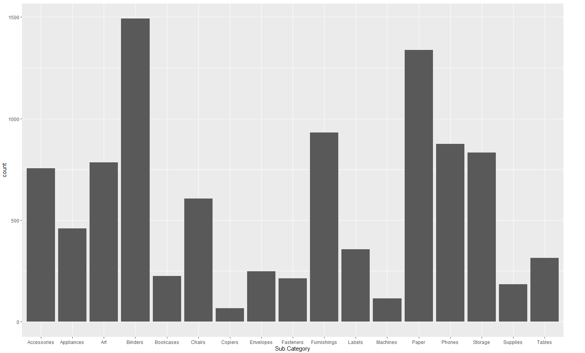

# R-Assignment 4

**Created by Thiti Ouengcharoen (ID: 63130500059)**

Dataset:
Superstore Sales Dataset (Data from Rohit Sahoo, [Kaggle](https://www.kaggle.com/rohitsahoo/sales-forecasting)) >> [Using CSV](https://raw.githubusercontent.com/safesit23/INT214-Statistics/main/datasets/superstore_sales.csv)


### Outlines
1. Explore the dataset
2. Learning about library => tm, wordcloud
3. Transform data with dplyr and finding insight the data
4. Visualization with GGplot2

## Part 1: Explore the dataset

```
# Library
# dplyr -> A Grammar of Data Manipulation
library(dplyr)
# readr -> Read Rectangular Text Data (like 'csv', 'tsv', and 'fwf')
library(readr)
# ggplot2 -> Create Elegant Data Visualisations Using the Grammar of Graphics
library(ggplot2)
# tm -> With commands to read information from various sources to create a data warehouse.
library(tm)
# wordcloud -> Can help build Graphics of words according to word frequency size.
library(wordcloud)

# Dataset
superstore_sales <- read.csv('https://raw.githubusercontent.com/safesit23/INT214-Statistics/main/datasets/superstore_sales.csv')
```

In this dataset has .....
Rows: 9,800
Columns: 18
$ Row.ID        <int> 1, 2, 3, 4, 5, 6, 7, 8, 9, 10, 11, 12, 13, 14, 15, 16, 17, 18, 19, 20, 21, 22, 23, 24, 25, 26, 27,~
$ Order.ID      <chr> "CA-2017-152156", "CA-2017-152156", "CA-2017-138688", "US-2016-108966", "US-2016-108966", "CA-2015~
$ Order.Date    <chr> "08/11/2017", "08/11/2017", "12/06/2017", "11/10/2016", "11/10/2016", "09/06/2015", "09/06/2015", ~
$ Ship.Date     <chr> "11/11/2017", "11/11/2017", "16/06/2017", "18/10/2016", "18/10/2016", "14/06/2015", "14/06/2015", ~
$ Ship.Mode     <chr> "Second Class", "Second Class", "Second Class", "Standard Class", "Standard Class", "Standard Clas~
$ Customer.ID   <chr> "CG-12520", "CG-12520", "DV-13045", "SO-20335", "SO-20335", "BH-11710", "BH-11710", "BH-11710", "B~
$ Customer.Name <chr> "Claire Gute", "Claire Gute", "Darrin Van Huff", "Sean O'Donnell", "Sean O'Donnell", "Brosina Hoff~
$ Segment       <chr> "Consumer", "Consumer", "Corporate", "Consumer", "Consumer", "Consumer", "Consumer", "Consumer", "~
$ Country       <chr> "United States", "United States", "United States", "United States", "United States", "United State~
$ City          <chr> "Henderson", "Henderson", "Los Angeles", "Fort Lauderdale", "Fort Lauderdale", "Los Angeles", "Los~
$ State         <chr> "Kentucky", "Kentucky", "California", "Florida", "Florida", "California", "California", "Californi~
$ Postal.Code   <int> 42420, 42420, 90036, 33311, 33311, 90032, 90032, 90032, 90032, 90032, 90032, 90032, 28027, 98103, ~
$ Region        <chr> "South", "South", "West", "South", "South", "West", "West", "West", "West", "West", "West", "West"~
$ Product.ID    <chr> "FUR-BO-10001798", "FUR-CH-10000454", "OFF-LA-10000240", "FUR-TA-10000577", "OFF-ST-10000760", "FU~
$ Category      <chr> "Furniture", "Furniture", "Office Supplies", "Furniture", "Office Supplies", "Furniture", "Office ~
$ Sub.Category  <chr> "Bookcases", "Chairs", "Labels", "Tables", "Storage", "Furnishings", "Art", "Phones", "Binders", "~
$ Product.Name  <chr> "Bush Somerset Collection Bookcase", "Hon Deluxe Fabric Upholstered Stacking Chairs, Rounded Back"~
$ Sales         <dbl> 261.9600, 731.9400, 14.6200, 957.5775, 22.3680, 48.8600, 7.2800, 907.1520, 18.5040, 114.9000, 1706~

## Part 2: Learning function from Tidyverse

- Function `wordcloud()` from package [dplyr](https://dplyr.tidyverse.org/articles/dplyr.html#select-columns-with-select)). It using for create Word Clouds
```
wordcloud(superstore_sales$State, max.words=100, colors=brewer.pal(8,"Dark2"))
```
Result:


## Part 3: Transform data with dplyr and finding insight the data

1. 
```
#Code here
```
Result:
```
#Copy Result from console to here
```
//Explain

2. 
```
#Code here
```
Result:
```
#Copy Result from console to here
```
//Explain

3. 
```
#Code here
```
Result:
```
#Copy Result from console to here
```

4. 
```
#Code here
```
Result:
```
#Copy Result from console to here
```

5. 
```
#Code here
```
Result:
```
#Copy Result from console to here
```
//Explain

6. 
```
#Code here
```
Result:
```
#Copy Result from console to here
```
//Explain

## Part 4: Visualization with GGplot2
### 1.) 
```

```
Result:


### 2.) 
```

```
Result:

