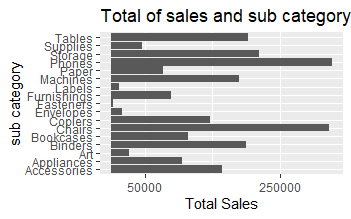
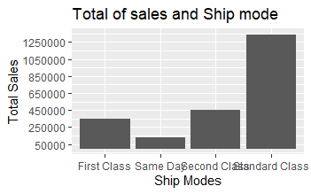

# R-Assignment 4

**Created by Papada Keawchaorn (ID: 63130500077)**

Choose Dataset: 
Superstore Sales Dataset (Data from Rohit Sahoo,[Kaggle](https://www.kaggle.com/rohitsahoo/sales-forecasting)) >> [Using CSV](https://raw.githubusercontent.com/safesit23/INT214-Statistics/main/datasets/superstore_sales.csv)


### Outlines
1. Explore the dataset
2. Learning function from Tidyverse
3. Transform data with dplyr and finding insight the data
4. Visualization with GGplot2

## Part 1: Explore the dataset

```
# Library
library(dplyr)
library(DescTools)
library(stringr)
library(ggplot2)
library(assertive)

# Dataset
Superstore <- read.csv("https://raw.githubusercontent.com/safesit23/INT214-Statistics/main/datasets/superstore_sales.csv")
View(Superstore)
glimpse(Superstore)
```

In this dataset has .....
Rows: 9,800
Columns: 18
```
$ Row.ID        <int> 1, 2, 3, 4, 5, 6, 7, 8, 9, 10, 11, 12, 13, ~
$ Order.ID      <chr> "CA-2017-152156", "CA-2017-152156", "CA-201~
$ Order.Date    <chr> "08/11/2017", "08/11/2017", "12/06/2017", "~
$ Ship.Date     <chr> "11/11/2017", "11/11/2017", "16/06/2017", "~
$ Ship.Mode     <chr> "Second Class", "Second Class", "Second Cla~
$ Customer.ID   <chr> "CG-12520", "CG-12520", "DV-13045", "SO-203~
$ Customer.Name <chr> "Claire Gute", "Claire Gute", "Darrin Van H~
$ Segment       <chr> "Consumer", "Consumer", "Corporate", "Consu~
$ Country       <chr> "United States", "United States", "United S~
$ City          <chr> "Henderson", "Henderson", "Los Angeles", "F~
$ State         <chr> "Kentucky", "Kentucky", "California", "Flor~
$ Postal.Code   <int> 42420, 42420, 90036, 33311, 33311, 90032, 9~
$ Region        <chr> "South", "South", "West", "South", "South",~
$ Product.ID    <chr> "FUR-BO-10001798", "FUR-CH-10000454", "OFF-~
$ Category      <chr> "Furniture", "Furniture", "Office Supplies"~
$ Sub.Category  <chr> "Bookcases", "Chairs", "Labels", "Tables", ~
$ Product.Name  <chr> "Bush Somerset Collection Bookcase", "Hon D~
$ Sales         <dbl> 261.9600, 731.9400, 14.6200, 957.5775, 22.3~
```


## Part 2: Learning function from Tidyverse

- Function `summarise()` from package [dplyr](https://dplyr.tidyverse.org/articles/dplyr.html#select-columns-with-select)). It using for reduces multiple values down to a single summary.

```
Superstore %>% summarise(Sales = max(Sales, na.rm = TRUE))
```


## Part 3: Transform data with dplyr and finding insight the data

- ข้อ 1 จำนวนคนที่เลือกการขนส่งแบบ First Class มีทั้งหมดเท่าไร

```
Superstore %>% filter(Ship.Mode=="First Class") %>% count()
```

Result:

```
n
1 1501
```
จำนวนคนที่เลือกการขนส่งแบบ First Class มีทั้งหมด 1501 คน คิดโดยใช้ filter() ในการคัดกรองคนที่เลือก First Class จากนั้นจึงนับจำนวนด้วยคำสั่ง count()


- ข้อ 2 ลูกค้าคนใดเป็นคนที่สั่งของกับทางร้านมากที่สุด และจำนวนกี่ครั้ง

```
Mode(Superstore$Customer.Name)
```

Result:

```
[1] "William Brown"
attr(,"freq")
[1] 35
```
William Brown เป็นคนที่สั่งของกับทางร้านมากที่สุด จำนวน 35 ครั้ง คิดโดยใช้ Mode() หาตัวที่มีความถี่มากที่สุดในคอลัมน์นั้น ๆ

- ข้อ 3 ราคาขายสินค้าต่อหนึ่งชิ้นที่มีราคามากที่สุดคืออะไร และราคาเท่าไร

```
Superstore %>% select(Product.Name, Sales) %>% filter(Sales==max(Sales))
```

Result:

```
Product.Name    Sales
1 Cisco TelePresence System EX90 Videoconferencing Unit 22638.48
```
ราคาขายสินค้าต่อหนึ่งชิ้นที่มีราคามากที่สุด คือ Cisco TelePresence System EX90 Videoconferencing Unit ราคา 22638.48 คิดโดยใช้ select() เลือกคอลัมน์ที่ต้องการให้แสดงผลออกมา และใช้ filter() ในการคัดกรองราคาขายที่มีค่าเท่ากับราคาขายที่มากที่สุด

- ข้อ 4 ประเภทของการขนส่งมีทั้งหมดกี่ประเภท และมีอะไรบ้าง ประเภทที่ลูกค้าใช้เยอะที่สุดคือประเภทใด

```
Superstore %>% distinct(Ship.Mode)
Mode(Superstore$Ship.Mode)
```

Result:

```
       Ship.Mode
1   Second Class
2 Standard Class
3    First Class
4       Same Day

[1] "Standard Class"
attr(,"freq")
[1] 5859
```
ประเภทของการขนส่งมีทั้งหมด 4 ประเภท ได้แก่ Second Class, Standard Class, First Class และ Same Day ประเภทที่ลูกค้าใช้เยอะที่สุด คือ Standard Class คิดโดยใช้ distinct() เพื่อประเภทขนส่งที่จะไม่ซ้ำกัน แล้วหาประเภทที่คนใช้เยอะที่สุดจาก Mode()

- ข้อ 5 หาสินค้าทั้งหมดที่มียอดขายมากกว่าค่าเฉลี่ยของยอดขายรวม

```
X <- Superstore %>% select(Product.Name, Sales) %>% filter(Sales>mean(Sales))
as_tibble(X)
```

Result:

```
   Product.Name                                               Sales
   <chr>                                                      <dbl>
 1 "Bush Somerset Collection Bookcase"                         262.
 2 "Hon Deluxe Fabric Upholstered Stacking Chairs, Rounded B~  732.
 3 "Bretford CR4500 Series Slim Rectangular Table"             958.
 4 "Mitel 5320 IP Phone VoIP phone"                            907.
 5 "Chromcraft Rectangular Conference Tables"                 1706.
 6 "Konftel 250 Conference phone - Charcoal black"           911.
 7 "Fellowes PB200 Plastic Comb Binding Machine"               408.
 8 "Stur-D-Stor Shelving, Vertical 5-Shelf: 72\"H x 36\"W x ~  666.
 9 "Bretford CR4500 Series Slim Rectangular Table"            1045.
10 "Riverside Palais Royal Lawyers Bookcase, Royale Cherry F~ 3083.
# ... with 2,305 more rows
```
มีสินค้าทั้งหมด 2315 รายการที่มียอดขายมากกว่าค่าเฉลี่ยของยอดขายรวม คิดโดยใช้ filter คัดกรองข้อมูลยอดขายที่มีค่ามากกว่า mean ออกมาแสดงผล

- ข้อ 6 หายอดขายรวมของสินค้าในแต่ละประเภทว่ามียอดขายเป็นเท่าไร

```
Superstore %>% group_by(Category) %>% select(Category,Sales) %>% summarise(total = sum(Sales))
```

Result:

```
  Category          total
  <chr>             <dbl>
1 Furniture       728659.
2 Office Supplies 705422.
3 Technology      827456.
```
ประเภท Furniture มียอดขาย 728659
ประเภท Office Supplies มียอดขาย 705422
ประเภท Technology มียอดขาย 827456 
คิดโดยใช้ group_by() เพื่อแยกกลุ่มตามหมวดหมู่ จากนั้นใช้ summarise() เพื่อรวมยอดของแต่ละหมวดหมู่ด้วยคำสั่ง sum

## Part 4: Visualization with GGplot2
### 1.) Graph show relation between sales and sub-category
```
sub_category_plot <- ggplot(Superstore, aes(x = Sales, y = Sub.Category))+
  geom_bar(stat="identity")+
  scale_x_continuous(breaks=c(50000 ,250000 ,450000 ,650000 ,850000))

sub_category_plot + ggtitle("Total of sales and sub category") +
  xlab("Total Sales") + ylab("sub category")
```
Result:



### 2.) Graph show relation between sales and Ship mode
```
ShipMode_plot <- ggplot(Superstore, aes(x = Ship.Mode, y = Sales))+
  geom_bar(stat="identity")+
  scale_y_continuous(breaks=c(50000 ,250000 ,450000 ,650000 ,850000, 1050000, 1250000))

ShipMode_plot + ggtitle("Total of sales and Ship mode") +
  xlab("Ship Modes") + ylab("Total Sales")
```

Result:



