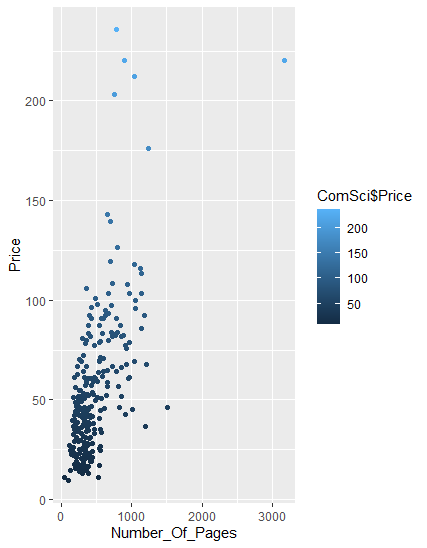
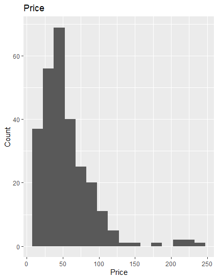

# R-Assignment 4

**Created by นาย ธนพัฒน์ ไตรรัตน์พนาสันต์(ID: 63130500049)**

Choose Dataset:
1. Top 270 Computer Science / Programing Books (Data from Thomas Konstantin, [Kaggle](https://www.kaggle.com/thomaskonstantin/top-270-rated-computer-science-programing-books)) >> [Using CSV](https://raw.githubusercontent.com/safesit23/INT214-Statistics/main/datasets/prog_book.csv)

2. Superstore Sales Dataset (Data from Rohit Sahoo,[Kaggle](https://www.kaggle.com/rohitsahoo/sales-forecasting)) >> [Using CSV](https://raw.githubusercontent.com/safesit23/INT214-Statistics/main/datasets/superstore_sales.csv)


### Outlines
1. Explore the dataset
2. Learning function from Tidyverse
3. Transform data with dplyr and finding insight the data
4. Visualization with GGplot2

## Part 1: Explore the dataset

```
# Library
library("dplyr")
library("ggplot2")
library('assertive')
library("readr")
library("stringr")
library("tibble")
library("tidyverse")

# Dataset
dataset Computer Science
ComSci <- read.csv("https://raw.githubusercontent.com/safesit23/INT214-Statistics/main/datasets/prog_book.csv")
```

### View this dataset 

```
glimpse(ComSci)
```

### this is in 

```
Rows: 271
Columns: 7
$ Rating          <dbl> 4.17, 4.01, 3.33, 3.97, 4.06, 3~
$ Reviews         <chr> "3,829", "1,406", "0", "1,658",~
$ Book_title      <chr> "The Elements of Style", "The I~
$ Description     <chr> "This style manual offers pract~
$ Number_Of_Pages <int> 105, 527, 50, 393, 305, 288, 25~
$ Type            <chr> "Hardcover", "Hardcover", "Kind~
$ Price           <dbl> 9.323529, 11.000000, 11.267647,~
```

### Check DataType
```
ComSci$Number_Of_Pages %>% is.numeric()//TRUE
ComSci$Book_title %>% is.character()//TRUE
ComSci$Rating %>% is.numeric()//TRUE
```

## Part 2: Learning function from Tidyverse

- Function `tibble()` from package [tibble](https://tibble.tidyverse.org/). It using for create table

```
tibble(x =0:20 , y = -(x^2) , z =x+y)
```

```
# A tibble: 21 x 3
       x     y     z
   <int> <dbl> <dbl>
 1     0     0     0
 2     1    -1     0
 3     2    -4    -2
 4     3    -9    -6
 5     4   -16   -12
 6     5   -25   -20
 7     6   -36   -30
 8     7   -49   -42
 9     8   -64   -56
10     9   -81   -72
# ... with 11 more rows
```

** You can sepearate this part or combine in part of `Transform data with dplyr and finding insight the data`


## Part 3: Transform data with dplyr and finding insight the data

### 3.1 find the max Reviews of this Dateset

```
ComSci$Reviews %>% str_remove(",") %>% as.numeric() %>% max(.,na.rm = T)
```

Result:

```
[1] 5938
```
Max reviews is 5938 


### 3.2 find average of Rating of this Dataset
```
ComSci$Rating %>% mean(.,na.rm=T)
```

Result:

```
[1] 4.067417
```
Rating has average 4.067417


### 3.3 check type of the book that has more than 900 pages in this Dataset
```
ComSci %>% filter(Number_Of_Pages > 900) %>% select(Type,Number_Of_Pages)
```

Result:
```
        Type Number_Of_Pages
1  Paperback            1200
2  Paperback             914
3  Paperback            1008
4  Hardcover            1506
5  Paperback             959
6  Paperback             976
7  Hardcover             927
8  Paperback            1214
9  Hardcover            1040
10 Hardcover             928
11 Paperback             908
12 Hardcover             976
13 Hardcover            1142
14 Hardcover            1180
15 Hardcover            1052
16 Hardcover            1056
17 Hardcover             978
18 Hardcover             976
19 Paperback            1136
20 Hardcover             936
21 Hardcover            1136
22 Hardcover            1132
23 Hardcover            1040
24 Hardcover            1235
25 Paperback            1040
26 Hardcover            3168
```

Book types have Paperback,Hardcover then it has pages more than 900 pages


### 3.4 find quantile2 of Rating this dataset
```
ComSci$Rating %>% quantile(0.5,na.rm = T)
```
Result:
```
50% 
4.1 
```
quantile 2 is 4.1


### 3.5 Show title , rating and price of this dataset that have rating more than 4.75
```
ComSci %>% filter(Rating > 4.75) %>% select(Book_title,Rating ,Price) %>% arrange(Rating)
```
Result:
```
Book_title Rating     Price
1 The Art of Computer Programming, Volumes 1-4a Boxed Set   4.77 220.38529
2                                 Your First App: Node.js   5.00  25.85588
```
All the Book title is rating more than 4.75

### 3.6 Show the price that more than 200 and ordering by desc
```
ComSci %>% filter(Price > 200) %>% select(Price) %>% arrange(desc(Price))
```
Result:
```
     Price
1 235.6500
2 220.3853
3 220.3853
4 212.0971
5 203.1088
```
this is all of price more than 200

## Part 4: Visualization with GGplot2
### 4.1) plot graph show relation between Price and Number of Pages
```
ComSci %>% ggplot(aes(x=Number_Of_Pages,y=Price))+geom_point(aes(color=ComSci$Price))
scat_plot+geom_smooth()
```
Result:



### 4.2 plot graph histogram show Price
```
ComSci %>% ggplot(aes(x=Price))+geom_histogram(binwidth = 15)+ggtitle("Price")+xlab("Price")+ylab("Count")
```
Result:



**Guideline:
Embed Image by using this syntax in markdown file
````

````
