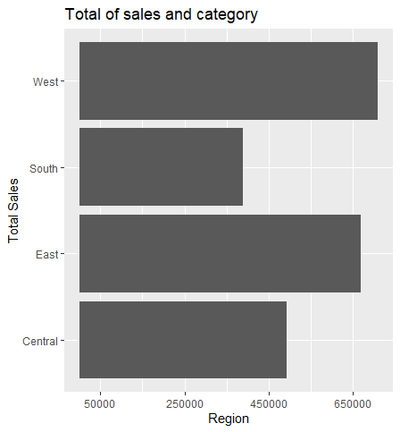

# R-Assignment 4

**Created by Name-Surname (ID: 63130500058)**

Choose Dataset:
1. Top 270 Computer Science / Programing Books (Data from Thomas Konstantin, [Kaggle](https://www.kaggle.com/thomaskonstantin/top-270-rated-computer-science-programing-books)) >> [Using CSV](https://raw.githubusercontent.com/safesit23/INT214-Statistics/main/datasets/prog_book.csv)

2. Superstore Sales Dataset (Data from Rohit Sahoo,[Kaggle](https://www.kaggle.com/rohitsahoo/sales-forecasting)) >> [Using CSV](https://raw.githubusercontent.com/safesit23/INT214-Statistics/main/datasets/superstore_sales.csv)


### Outlines
1. Explore the dataset
2. Learning function from Tidyverse
3. Transform data with dplyr and finding insight the data
4. Visualization with GGplot2

## Part 1: Explore the dataset

```
# Library
library(dplyr)
library(ggplot2)
library(assertive)

# 1. Explore the dataset
superstore<- read.csv('https://raw.githubusercontent.com/safesit23/INT214-Statistics/main/datasets/superstore_sales.csv')
glimpse(superstore)
View(superstore)
```

In this dataset has ..... 
Rows: 9,800
Columns: 18
```
$ Row.ID        <int> 1, 2, 3, 4, 5, 6, 7, 8, 9, 10, 11, 12, 13, 14, 15~
$ Order.ID      <chr> "CA-2017-152156", "CA-2017-152156", "CA-2017-1386~
$ Order.Date    <chr> "08/11/2017", "08/11/2017", "12/06/2017", "11/10/~
$ Ship.Date     <chr> "11/11/2017", "11/11/2017", "16/06/2017", "18/10/~
$ Ship.Mode     <chr> "Second Class", "Second Class", "Second Class", "~
$ Customer.ID   <chr> "CG-12520", "CG-12520", "DV-13045", "SO-20335", "~
$ Customer.Name <chr> "Claire Gute", "Claire Gute", "Darrin Van Huff", ~
$ Segment       <chr> "Consumer", "Consumer", "Corporate", "Consumer", ~
$ Country       <chr> "United States", "United States", "United States"~
$ City          <chr> "Henderson", "Henderson", "Los Angeles", "Fort La~
$ State         <chr> "Kentucky", "Kentucky", "California", "Florida", ~
$ Postal.Code   <int> 42420, 42420, 90036, 33311, 33311, 90032, 90032, ~
$ Region        <chr> "South", "South", "West", "South", "South", "West~
$ Product.ID    <chr> "FUR-BO-10001798", "FUR-CH-10000454", "OFF-LA-100~
$ Category      <chr> "Furniture", "Furniture", "Office Supplies", "Fur~
$ Sub.Category  <chr> "Bookcases", "Chairs", "Labels", "Tables", "Stora~
$ Product.Name  <chr> "Bush Somerset Collection Bookcase", "Hon Deluxe ~
$ Sales         <dbl> 261.9600, 731.9400, 14.6200, 957.5775, 22.3680, 4~
```

## Part 2: Learning function from Tidyverse

- Function `filter()` from package [dplyr](https://dplyr.tidyverse.org/articles/dplyr.html#select-columns-with-select)). It using for select a subset of rows in a data frame

```
superstore_filter <- superstore %>% 
  filter(Order.ID == "CA-2017-138688")
glimpse(superstore_filter)
```
Result :
```
Rows: 1
Columns: 18
$ Row.ID        <int> 3
$ Order.ID      <chr> "CA-2017-138688"
$ Order.Date    <chr> "12/06/2017"
$ Ship.Date     <chr> "16/06/2017"
$ Ship.Mode     <chr> "Second Class"
$ Customer.ID   <chr> "DV-13045"
$ Customer.Name <chr> "Darrin Van Huff"
$ Segment       <chr> "Corporate"
$ Country       <chr> "United States"
$ City          <chr> "Los Angeles"
$ State         <chr> "California"
$ Postal.Code   <int> 90036
$ Region        <chr> "West"
$ Product.ID    <chr> "OFF-LA-10000240"
$ Category      <chr> "Office Supplies"
$ Sub.Category  <chr> "Labels"
$ Product.Name  <chr> "Self-Adhesive Address Labels for Typewriters by Universal"
$ Sales         <dbl> 14.62
```

## Part 3: Transform data with dplyr and finding insight the data

1. สินค้าใดที่ได้รับความนิยมสูงสุดและมีจำนวนเท่าไหร่

```
superstore_max <- superstore %>% 
  filter(Product.Name == max(Product.Name)) %>% 
  select(Product.Name)
glimpse(superstore_max)
```

Result:

```
Rows: 13
Columns: 1
$ Product.Name <chr> "Zipper Ring Binder Pockets", "Zipper Ring Binder Pockets", "~
```
//สินค้าที่ได้รับความนิยมสูงสุดคือ Zipper Ring Binder Pockets โดยมีจำนวนทั้งหมด 13 ชิ้น

2. สินค้าใดที่ได้รับความนิยมน้อยสุดและมีจำนวนเท่าไหร่

```
superstore_min <- superstore %>% 
  filter(Product.Name == min(Product.Name)) %>% 
  select(Product.Name)
glimpse(superstore_min)
```

Result:

```
Rows: 3
Columns: 1
$ Product.Name <chr> "\"While you Were Out\" Message Book, One Form per Page", "\"~
```
//สินค้าที่ได้รับความนิยมน้อยสุดคือ Zipper Ring Binder Pockets โดยมีจำนวนทั้งหมด 3 ชิ้น

3. ยอดขายรวมของแต่ละ city ที่มียอดขายรวมมากกว่า 10000 โดยเรียงยอดขายรวมจากมากไปน้อย

```
sumcities <- superstore %>% 
  group_by(City) %>% 
  summarise(totalsale = sum(Sales)) %>%
  filter(totalsale >= 100000) %>%
  arrange(desc(totalsale))
sumcities
```

Result:

```
  City          totalsale
  <chr>             <dbl>
1 New York City   252463.
2 Los Angeles     173420.
3 Seattle         116106.
4 San Francisco   109041.
5 Philadelphia    108842.
```
//city ที่มียอดขายรวมมากกว่า 10000 โดยเรียงยอดขายรวมจากมากไปน้อยจะมีดังนี้
- New York City   252463.
- Los Angeles     173420.
- Seattle         116106.
- San Francisco   109041.
- Philadelphia    108842.

4. พนักงานที่อยู่ในสาขาเมือง San Francisco มีการขายสินค้าอะไรบ้าง

```
SanFran_Customer <- superstore %>% 
  select(Customer.Name, City, Product.Name) %>% 
  filter(City == "San Francisco")
as_tibble(SanFran_Customer)
```

Result:

```
 Customer.Name      City          Product.Name                                    
   <chr>              <chr>         <chr>                                           
 1 Zuschuss Donatelli San Francisco "Newell 341"                                    
 2 Zuschuss Donatelli San Francisco "Cisco SPA 501G IP Phone"                       
 3 Zuschuss Donatelli San Francisco "Wilson Jones Hanging View Binder, White, 1\""  
 4 Duane Noonan       San Francisco "Premium Writing Pencils, Soft, #2 by Central A~
 5 Duane Noonan       San Francisco "Sortfiler Multipurpose Personal File Organizer~
 6 Katherine Ducich   San Francisco "Trimflex Flexible Post Binders"                
 7 Sally Hughsby      San Francisco "Newell 343"                                    
 8 Sally Hughsby      San Francisco "Convenience Packs of Business Envelopes"       
 9 Sally Hughsby      San Francisco "Xerox 1911"                                    
10 Logan Haushalter   San Francisco "Global Leather Highback Executive Chair with P~
# ... with 490 more rows
```
//ตามใน Result

5. ลูกค้าคนใดที่ซื้อสินค้าราคาถูกที่สุด

```
cheapestPrice <- superstore %>% 
  select(Customer.Name,Product.Name,Sales) %>% 
  filter(superstore$Sales == min(superstore$Sales))
as_tibble(cheapestPrice)

```

Result:

```
 Customer.Name    Product.Name                                                Sales
  <chr>            <chr>                                                       <dbl>
1 Zuschuss Carroll Hoover Replacement Belt for Commercial Guardsman Heavy-Dut~ 0.444
```
//ลูกค้าที่ชื่อ Zuschuss Carroll ได้ซื้อสินค้าราคาที่ถูกสุดไปในราคา 0.444

6.  ให้แสดงสินค้าที่มีชื่อขึ้นต้นด้วยคำว่า Panasonic   

```
findPanasonic <- str_subset(superstore$Product.Name, "Panasonic");
as_tibble(findPanasonic)
```

Result:

```
value                                                     
   <chr>                                                     
 1 Panasonic Kx-TS550                                        
 2 Panasonic Kx-TS550                                        
 3 Panasonic KX-TG6844B Expandable Digital Cordless Telephone
 4 Panasonic Kx-TS550                                        
 5 Panasonic KX-TG9471B                                      
 6 Panasonic KP-380BK Classic Electric Pencil Sharpener      
 7 Panasonic KP-310 Heavy-Duty Electric Pencil Sharpener     
 8 Panasonic KX T7731-B Digital phone                        
 9 Panasonic KP-150 Electric Pencil Sharpener                
10 Panasonic KX-TG9471B                                      
# ... with 62 more rows
> 
```
//ตามใน Result


## Part 4: Visualization with GGplot2
### 1.)  กราฟที่แสดงความสัมพันธ์ระหว่าง sales กับ category
```
category_plot <- ggplot(superstore, aes(x = Category, y = Sales))+
  geom_bar(stat="identity")+
  scale_y_continuous(breaks=c(50000 ,250000 ,450000 ,650000 ,850000))

category_plot + ggtitle("Total of sales and category") +
  xlab("Total Sales") + ylab("Category")
```
Result:


### 2.)  กราฟที่แสดงความสัมพันธ์ระหว่าง sales กับ region
```
region_plot <- ggplot(superstore, aes(x = Sales, y = Region))+
  geom_bar(stat="identity")+
  scale_x_continuous(breaks=c(50000 ,250000 ,450000 ,650000 ,850000))

region_plot + ggtitle("Total of sales and category") +
  xlab("Region") + ylab("Total Sales")
```
Result: 



**Guideline:
Embed Image by using this syntax in markdown file
````

````
