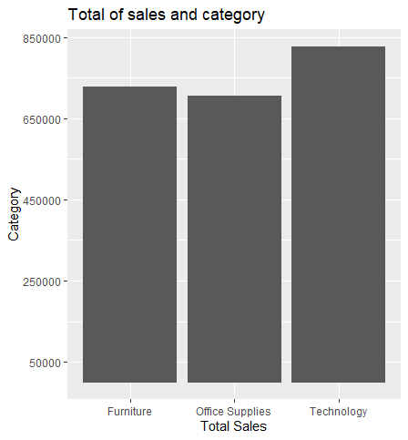

# R-Assignment 4

**Created by Name-Surname (ID: 63130500058)**

Choose Dataset:
1. Top 270 Computer Science / Programing Books (Data from Thomas Konstantin, [Kaggle](https://www.kaggle.com/thomaskonstantin/top-270-rated-computer-science-programing-books)) >> [Using CSV](https://raw.githubusercontent.com/safesit23/INT214-Statistics/main/datasets/prog_book.csv)

2. Superstore Sales Dataset (Data from Rohit Sahoo,[Kaggle](https://www.kaggle.com/rohitsahoo/sales-forecasting)) >> [Using CSV](https://raw.githubusercontent.com/safesit23/INT214-Statistics/main/datasets/superstore_sales.csv)


### Outlines
1. Explore the dataset
2. Learning function from Tidyverse
3. Transform data with dplyr and finding insight the data
4. Visualization with GGplot2

## Part 1: Explore the dataset

```
# Library
library(dplyr)
library(ggplot2)
library(assertive)

# 1. Explore the dataset
superstore<- read.csv('https://raw.githubusercontent.com/safesit23/INT214-Statistics/main/datasets/superstore_sales.csv')
glimpse(superstore)
View(superstore)
```

In this dataset has ..... 
Rows: 9,800
Columns: 18
```
$ Row.ID        <int> 1, 2, 3, 4, 5, 6, 7, 8, 9, 10, 11, 12, 13, 14, 15~
$ Order.ID      <chr> "CA-2017-152156", "CA-2017-152156", "CA-2017-1386~
$ Order.Date    <chr> "08/11/2017", "08/11/2017", "12/06/2017", "11/10/~
$ Ship.Date     <chr> "11/11/2017", "11/11/2017", "16/06/2017", "18/10/~
$ Ship.Mode     <chr> "Second Class", "Second Class", "Second Class", "~
$ Customer.ID   <chr> "CG-12520", "CG-12520", "DV-13045", "SO-20335", "~
$ Customer.Name <chr> "Claire Gute", "Claire Gute", "Darrin Van Huff", ~
$ Segment       <chr> "Consumer", "Consumer", "Corporate", "Consumer", ~
$ Country       <chr> "United States", "United States", "United States"~
$ City          <chr> "Henderson", "Henderson", "Los Angeles", "Fort La~
$ State         <chr> "Kentucky", "Kentucky", "California", "Florida", ~
$ Postal.Code   <int> 42420, 42420, 90036, 33311, 33311, 90032, 90032, ~
$ Region        <chr> "South", "South", "West", "South", "South", "West~
$ Product.ID    <chr> "FUR-BO-10001798", "FUR-CH-10000454", "OFF-LA-100~
$ Category      <chr> "Furniture", "Furniture", "Office Supplies", "Fur~
$ Sub.Category  <chr> "Bookcases", "Chairs", "Labels", "Tables", "Stora~
$ Product.Name  <chr> "Bush Somerset Collection Bookcase", "Hon Deluxe ~
$ Sales         <dbl> 261.9600, 731.9400, 14.6200, 957.5775, 22.3680, 4~
```

## Part 2: Learning function from Tidyverse

- Function `filter()` from package [dplyr](https://dplyr.tidyverse.org/articles/dplyr.html#select-columns-with-select)). It using for select a subset of rows in a data frame

```
superstore_filter <- superstore %>% filter(Order.ID == "CA-2017-138688")
glimpse(superstore_filter)
```
Result :
```
Rows: 1
Columns: 18
$ Row.ID        <int> 3
$ Order.ID      <chr> "CA-2017-138688"
$ Order.Date    <chr> "12/06/2017"
$ Ship.Date     <chr> "16/06/2017"
$ Ship.Mode     <chr> "Second Class"
$ Customer.ID   <chr> "DV-13045"
$ Customer.Name <chr> "Darrin Van Huff"
$ Segment       <chr> "Corporate"
$ Country       <chr> "United States"
$ City          <chr> "Los Angeles"
$ State         <chr> "California"
$ Postal.Code   <int> 90036
$ Region        <chr> "West"
$ Product.ID    <chr> "OFF-LA-10000240"
$ Category      <chr> "Office Supplies"
$ Sub.Category  <chr> "Labels"
$ Product.Name  <chr> "Self-Adhesive Address Labels for Typewriters by Universal"
$ Sales         <dbl> 14.62
```

## Part 3: Transform data with dplyr and finding insight the data

//Explain here

```
#Code here
```

Result:

```
#Copy Result from console to here
```
//Explain

- list 1
- list 2

## Part 4: Visualization with GGplot2
### 1.) Graph show relation between height and mass
```
scat_plot <- starwars %>% filter(mass<500) %>% ggplot(aes(x=height,y=mass))+
  geom_point(aes(color=gender))

scat_plot+geom_smooth()
```
Result:



**Guideline:
Embed Image by using this syntax in markdown file
````

````
